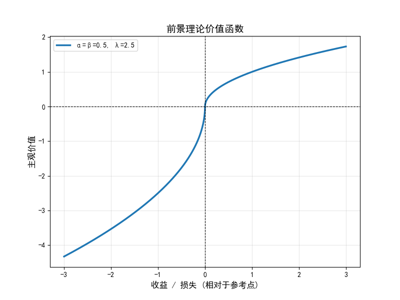

+++
date = '2026-03-11T16:12:14+08:00'
draft = true
title = '经济心理学'
categories = ["笔记"]
tags = ["学业", "大二下", "心理学"]
+++

## 前景理论（Prospect Theory）

前景理论指出人们在面对不确定性进行决策时，并不是基于最终财富的绝对值，而是基于相对于某个参照点（Reference Point）的损益变化。

## Homework_1

### Question

为什么大多数人面对收益（gain）和损失（loss）时表现出不同的风险偏好？损失厌恶（loss aversion）是指什么？请你绘制前景理论（prospect theory）的价值函数，根据前景理论对这两个问题进行解答和分析。（5分）

### Answer

- 前景理论的价值函数具有不对称性，损失区的斜率比收益区的斜率更陡，所以人们在面对收益时更多体现出风险厌恶而在面对损失时体现出风险偏好（赌一把）。

- 损失厌恶在价值函数中的体现为在原点左侧（损失区）比右侧（收益区）更陡峭。数学表达为如果用 V(x) 表示价值，当 x > 0 时，损失厌恶意味着 |V(-x)| > V(x)。表现为人面对同等价值的收益和损失，在损失时得到的痛苦会比收益时收获的快乐更多。