---
# --- 基础元数据 ---
title: "课程初体验"
date: 2026-03-02T10:24:13+08:00
# lastmod: 2024-02-01T12:00:00+08:00
description: "上学期期末周的极限补天太痛苦了，cy打算按部就班地好好学习一次，毕竟在准备考研之前安心学好课程知识的机会不多了。"
# slug: "my-post-url"           # 强制指定网址后缀（建议英文/数字/横杠）
draft: false                  # 发布前记得改为 false

# --- 分类与标签 ---
categories: ["杂谈"]
tags: ["学业","公开","大二下"]

# --- 封面图配置 (Hero Image) ---
# 必须将图片放在当前文件夹下，填写文件名即可
# 如果你想关闭首页卡片上的图片，将以下删除或设为 ""
article:
  showDate: true             # 是否显示发布日期
  showReadingTime: true      # 是否显示预计阅读时间
  showWordCount: true        # 是否显示字数统计
  hero: "featured.jpg"       # 封面图片文件名
  layout: "background"       # 可选: basic, background (封面图作为大背景)

# --- 首页卡片微调 ---
showOnHomePage: true         # 是否在首页显示
showTaxonomies: true         # 是否在卡片上显示标签/分类
# featureImage: "thumbnail.jpg" # 如果你想让首页卡片图和文章内封面图不一样，启用这一行

# --- 目录配置 ---
showTableOfContents: true    # 开启目录（右侧悬浮）
nativeTableOfContents: false # 设置为 true 则目录显示在正文上方

# --- 系列文章 (Series) ---
# 如果你想把几篇文章关联起来，给它们填同一个名字
# series: ["Hugo 进阶指南"]
# series_order: 1              # 在系列中的排序

# --- 外部链接跳转 (可选) ---
# externalUrl: "https://example.com" # 启用后，点击文章标题会直接跳到外部链接
---

## 健美（初级）

### 史倩玉

非常好的体验，史老师人美心善身材好，非常温柔，而且还能准确地念出我的名字。与以往不同的是这堂课并没有采用手机签到，而是用比较原始的口头点名的形式，增强了互动性，我还是很喜欢的。另外，这节课还有自我介绍环节，可惜我站起来讲的时候也太紧张了，怎么这么不自信，口头语言组织能力真的退化很多了。

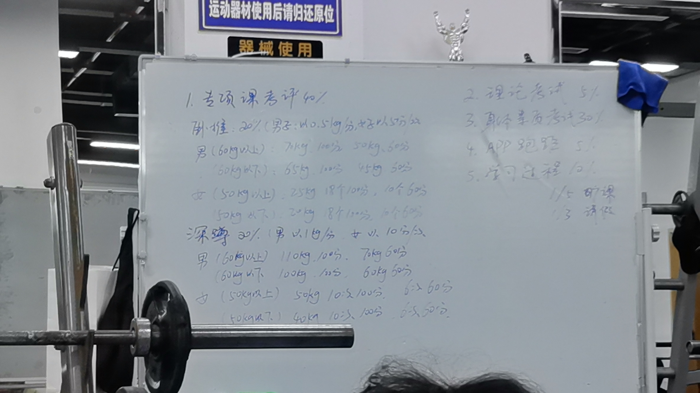

## 生理心理学

### 张智君

看了一圈98发现全是在骂生心的，那没辙。老师感觉人还不错，就是上课叽里咕噜我也听不懂他在说什么，问了一下前辈之后就打算面向期末周学习了（对照着可达鸭学长的资料和小心鸡的资料背即可）。吐槽一下这个教室，我要在这儿几乎上一整天结果告诉我连个插座也没有，学鸡毛呀。

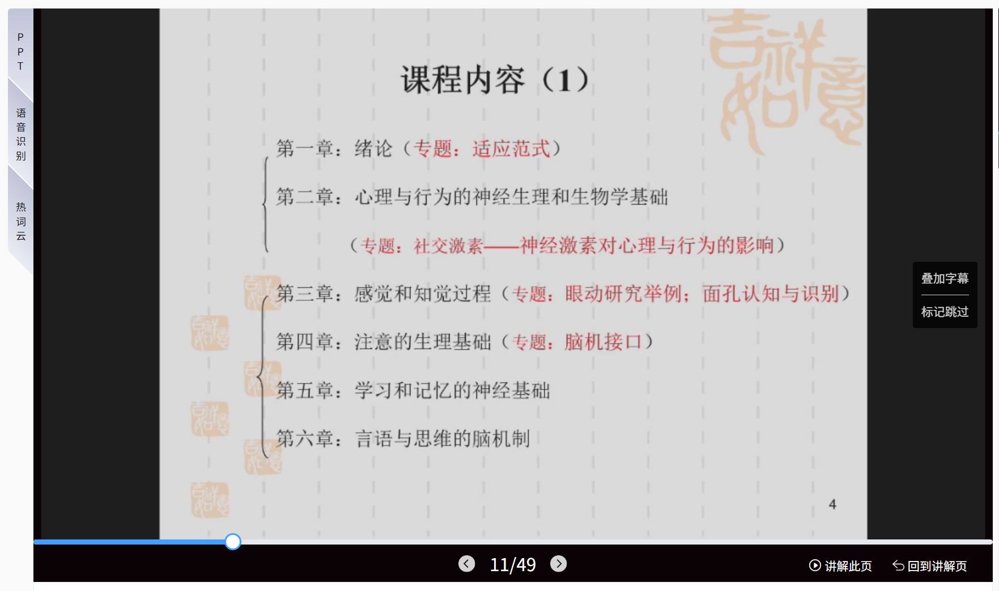
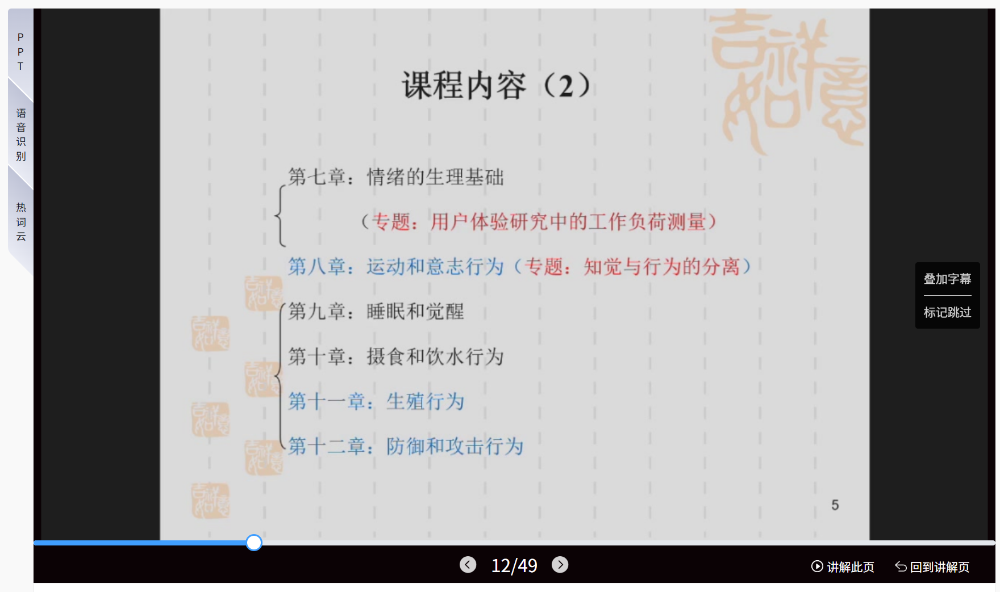
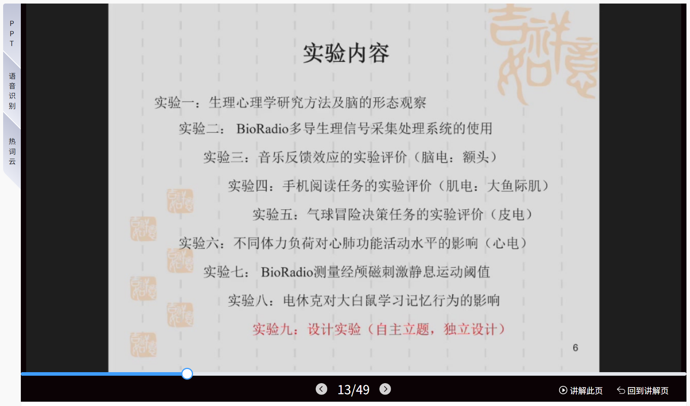

在这里附一份可达鸭学长的良心复习资料：

原文链接：<https://www.cc98.org/topic/5925084>

## 实验心理学

### 陈辉/董一胜

陈辉虽然感觉破事多脾气差，但是交代事情挺清楚的，咬字也能听明白。比较逆天的发言是要关掉他这门课的智云课堂，纯当乐子看，因为反正我也不会去听智云。之后绪论聊了些有的没的，都是比较深入浅出的知识，讲话的风格有点像陈军辉。

二编：大多数心理的同学上学期都认识董一胜了，我是第一次见，很喜欢他上课的风格，而且听说他从来不点名。也是风格比较幽默风趣的老师（这个学期的老师怎么都不太严肃的样子），能把问题讲得很明白，而且他讲关于心理学发展以及巴普洛夫后续的研究都比较有吸引力，让人产生一种愿意去探索心理学的冲动。后续可以去了解一下相关方向，以及尽可能做一做实验心理学的相关笔记。（时间有点久了感情消磨，这段文字略显干涩，憾）

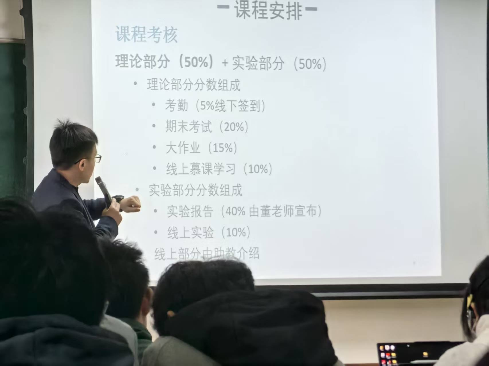

## 经济心理学

### 陈志琴

昨天上这个课的时候已经基本昏迷了，上节课昏睡了一会，经心的时候基本就是盯着时钟等下课。第一节课老师基本算是跟我们在聊天，毕竟这门课有非常多跨专业的同学选，估计也不会太难。~~不过似乎心理本来也没什么专业壁垒~~。老师本人还是很有人格魅力的，本硕博三个阶段读了三个完全不相干的专业，也是比较幽默风趣的类型，喜欢和同学互动（也是口头点名也能叫出我的名字）。重要的是老师还说期末考前会发详细的考点资料，很让人安心了。

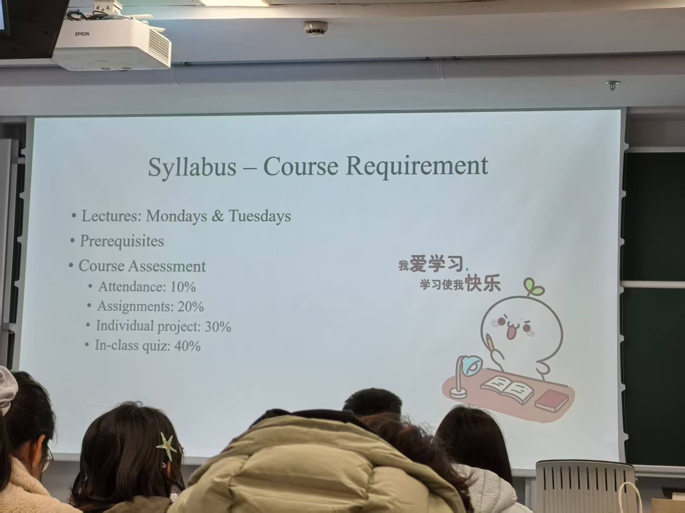

## 实验设计与心理统计Ⅱ

### 沈模卫/董一胜

前一天晚上发高烧，早八没去。

二编：实验课讲了一些对于心统一的回顾以及之后的教学安排，由于上学期概统实在学得太烂，只花了一天时间补天，统计知识本来就没会多少现在记得的更不多了。需要花一两次的自习时间学习一下心统一的陌生知识，然后再好好学习一下统计相关知识。

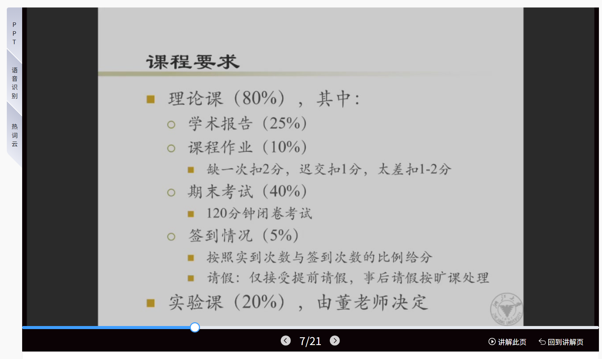

## 隐私计算与数据合规

### 张秉晟

老师是比较幽默风趣的，听他的经历（兴趣爱好，认识网红之类的）猜测是那种**高智商风流人士**。一开始说是这个课会比较难可能风格和张聪的密码学感觉差不多，给我吓了一跳，特别是看了历年卷也有IND-CPA之类的。但是后面发现老师讲课还是比较深入浅出有意思，重要的是不像张聪全程在黑板上讲，有很详细清楚的ppt，甚至有时间的话还能提前预习，所以学习难度和压力应该会少不少。~~不会这就是那位不知名的学长做了密码学的笔记但是没做隐私计算的原因吧。~~

我大概率会写一份关于这门课的学习笔记，这里附上跳转链接：[隐私计算与数据合规](https://ccc-yuan.github.io/Personal-Homepage/posts/%E9%9A%90%E7%A7%81%E8%AE%A1%E7%AE%97%E4%B8%8E%E6%95%B0%E6%8D%AE%E5%90%88%E8%A7%84/)

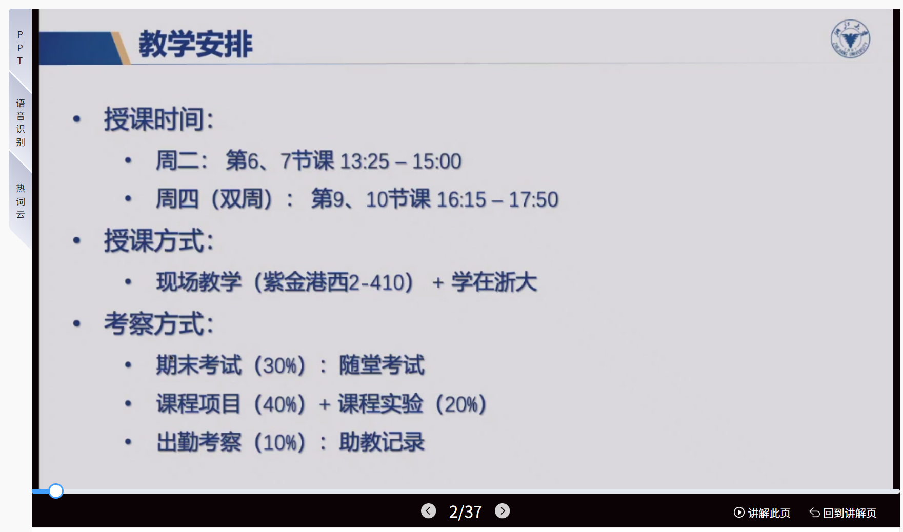

## 中国改革开放史

### 叶建亮

没抵御住元宵节的诱惑，加之csj先生对于本课程第一次课不签到的承诺，没去，然后直接通知每节课都要签到，悲。
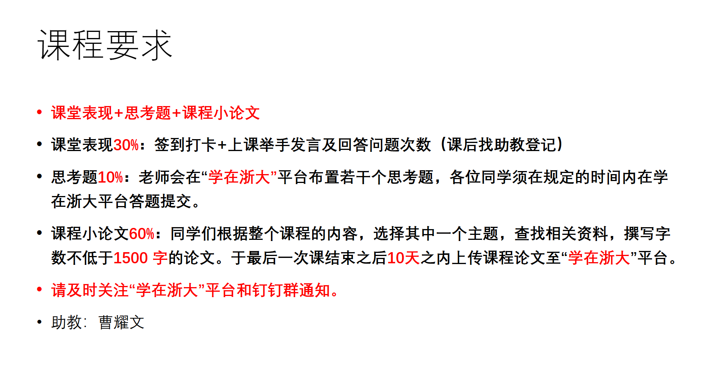

## 中国现当代小说鉴赏

### 黄擎

课不难也不晦涩，也没有完全陶醉其中的吸引力，就和我读大部分小说的直观感受一样，如同品一壶茶。老师是一位温文尔雅的中年女士，一张口带来的文学气息以及午后暖洋洋的困倦感仿佛要把人带回高中时期，我提醒自己，多少要捧起书来读一些了。大学里过多的口头表达和大模型的泛滥瓦解了我本就不多了文学素养，开始做网站很大也有这一份意图所在。希望之后不多的七次课里，可以关上手机，带上一本纸质书，给光标闪烁的生活里加一点闲情致逸。

## 马克思主义基本原理

### 赵坤

知书达理的谦逊的老师，课程的进行基本以同学做课堂展示为主。

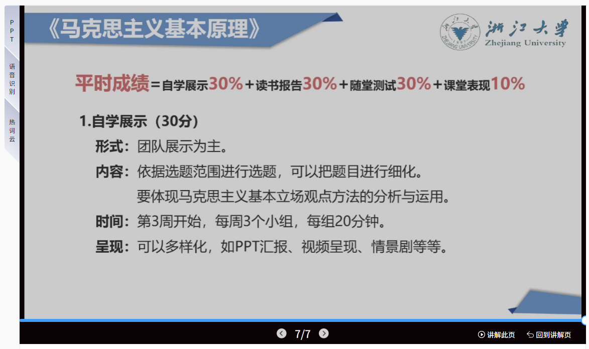
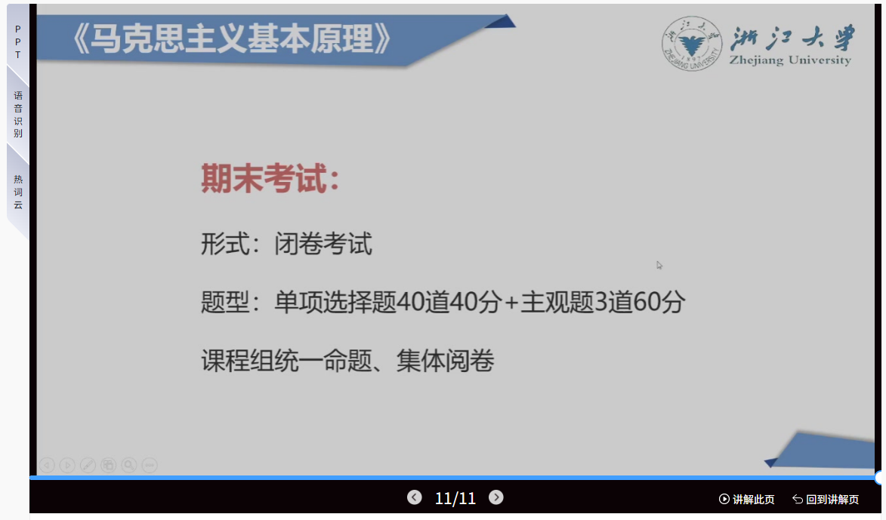