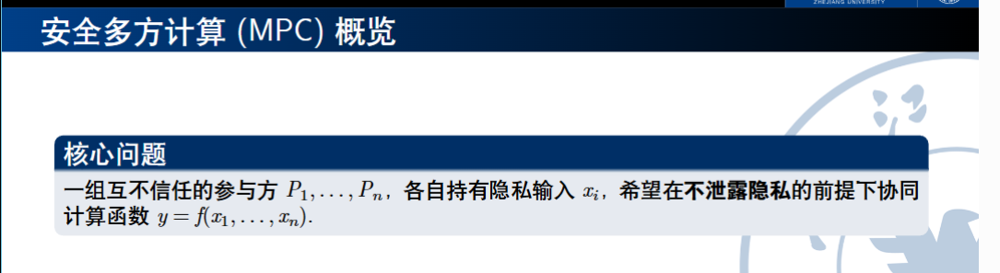
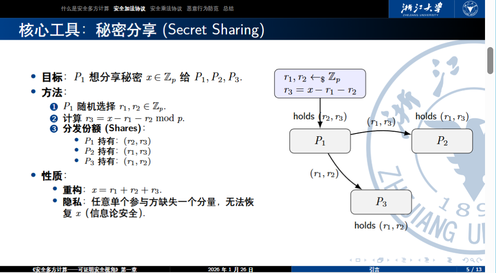
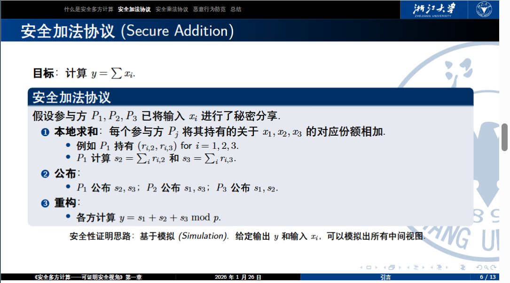
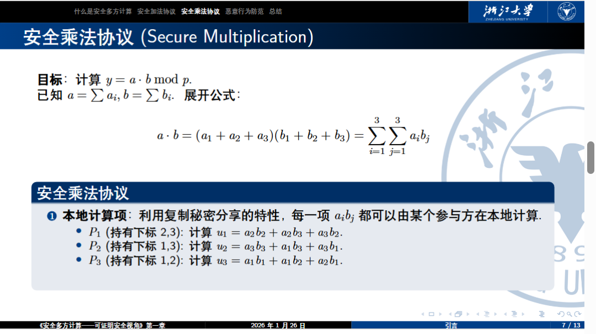
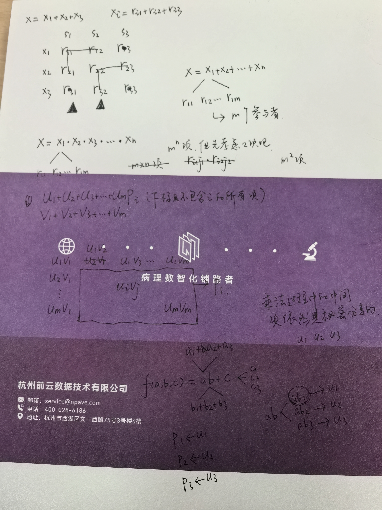

课程PPT：

[绪论](第一课.pdf)

[mpc_teaching_slides_beamer_1.pdf](mpc_teaching_slides_beamer_1.pdf)

[mpc_teaching_slides_beamer_2.pdf](mpc_teaching_slides_beamer_2.pdf)

[mpc_teaching_slides_beamer_3.pdf](mpc_teaching_slides_beamer_3.pdf)

[mpc_teaching_slides_beamer_4.pdf](mpc_teaching_slides_beamer_4.pdf)

[mpc_teaching_slides_beamer_5.pdf](mpc_teaching_slides_beamer_5.pdf)

[mpc_teaching_slides_beamer_6.pdf](mpc_teaching_slides_beamer_6.pdf)

[mpc_teaching_slides_beamer_7.pdf](mpc_teaching_slides_beamer_7.pdf)

[mpc_teaching_slides_beamer_8.pdf](mpc_teaching_slides_beamer_8.pdf)

[mpc_teaching_slides_beamer_9.1.pdf](mpc_teaching_slides_beamer_9.1.pdf)

[mpc_teaching_slides_beamer_9.2.pdf](mpc_teaching_slides_beamer_9.2.pdf)

## 引言

### 专有名词

安全多方计算 (MPC)
理想世界 (Trusted Third Party，TTP)
秘密分享 (Secret Sharing)
安全加法协议 (Secure Addition)
安全乘法协议 (Secure Multiplication)

### 核心问题

考虑这样一个问题，如果全班要统计六级考试的平均分，如何在每个同学都不泄露个人隐私的情况下实现平均分的计算呢？

有一个小巧思是，第一个人把自己的分数和一个随机数相加，传给下一个人，之后每个人在此基础上加上自己的分数，最后第一个人减去随机数得到所有人的分数和。但是这个方法的问题在于效率过低，同时依旧会有隐私泄露问题（例如，假如随机数存在范围那么第一个人的分数就会泄露信息）。

### 秘密分享

等价于一次一密安全，每个参与方持有两个数据份额，可以进行一致性检查 (Consistency Check)。

### 安全加法协议

### 安全乘法协议

任何函数都可以表示为加法和乘法电路 ⇒ 我们可以安全计算任何函数！

但是由于安全乘法计算过后每个参与方手里只留下了一个份额，无法再进行后续的加法或者乘法运算，所以仅仅本地计算是无法完成复杂的函数计算的，需要MPC节点之间相互通信来解决这个问题。同时，这也是为什么乘法运算的数据格式坍塌(Format Collapse)会使其有不能检测违背协议的行为的局限性。

### 手稿

